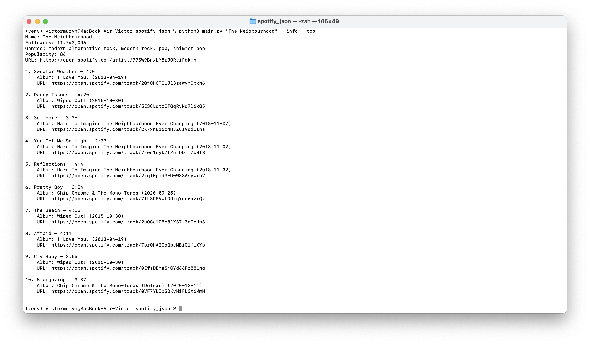

# Spotify JSON

## About project

This project helps you get information about artist so quickly and easily. Just try it!

## Result example

Example for the following command

```cmd
python3 main.py "The Neigbourhood" --info --top
```



## Installation and start

To start project do following commands:

### Install requirements

1. Clone the repository and open folder in terminal.
2. Create virtual enviroment and install requirements:

```cmd
python3 -m venv venv

source venv/bin/activate # if you are using MacOS
venv/bin/activate # for Windows

pip3 install requirements.txt
```

### Start project

Parameters

```
positional arguments:
  name           Name of artist

options:
  -h, --help     show this help message and exit
  -a, --albums   Get artist's albums.
  -r, --related  Get related artist.
  -t, --top      Get top tracks
  -i, --info     Get info about artist
```

```cmd
python3 main.py {artist_name} [-i] [-t] [-r] [-a]
```

### Determinate

```cmd
deactivate
```

## Contributing

Pull requests are welcome. For major changes, please open an issue first
to discuss what you would like to change.

Please make sure to update tests as appropriate.

## License

[Apache-2.0](https://www.apache.org/licenses/LICENSE-2.0)
